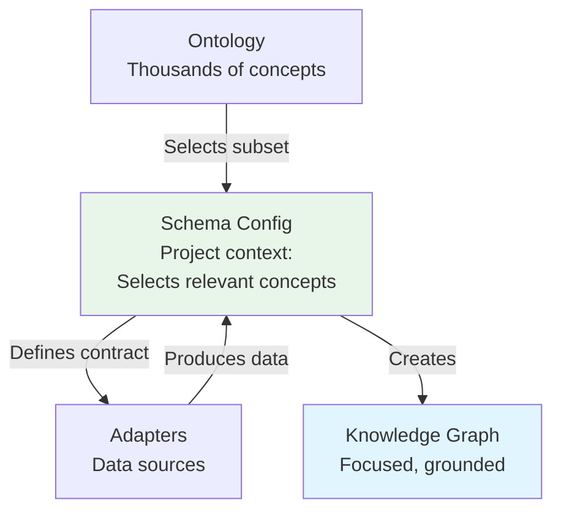
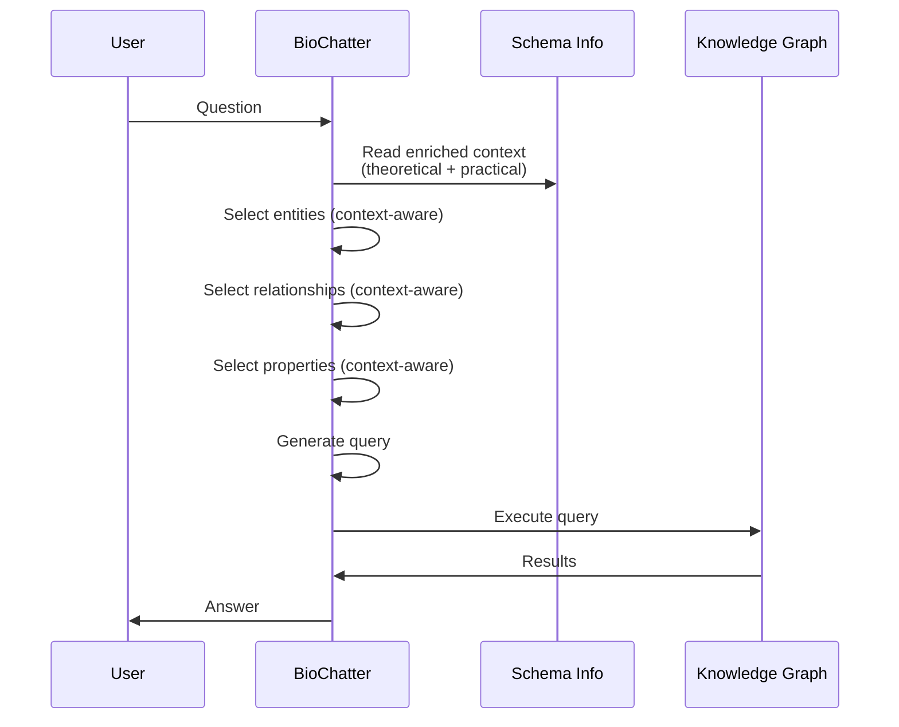
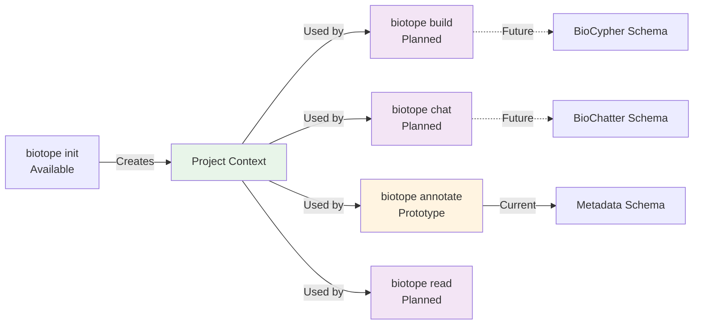
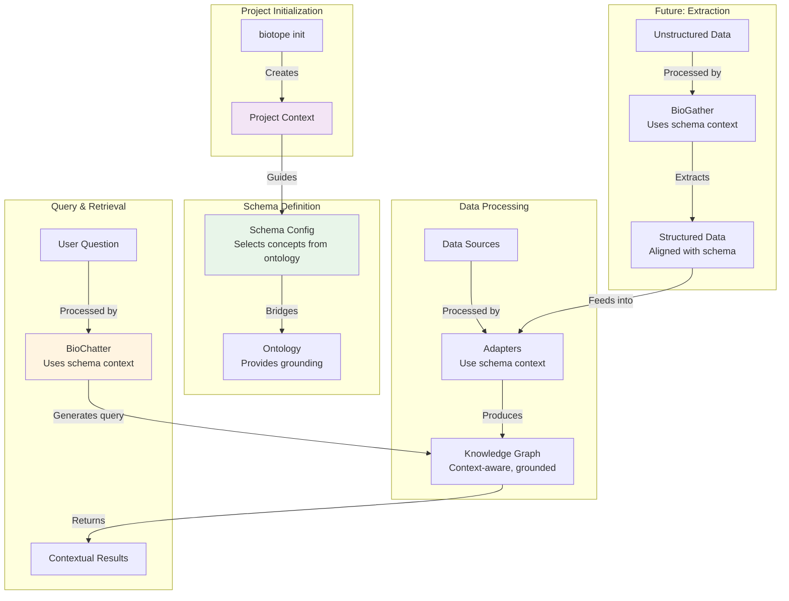

# The Philosophy of Context-Aware Knowledge Management

The BioCypher ecosystem is built on a fundamental principle: **using project context to improve workflows and performance**. This philosophy manifests across all ecosystem components—from BioCypher's schema configuration to BioChatter's retrieval processes, Biotope's project management, and future tools like BioGather.

## The Core Principle: Context as a Bridge

At the heart of our approach is the recognition that effective knowledge management requires balancing two complementary concerns:

1. **Semantic Grounding**: Connecting to well-defined, machine-readable concepts from biomedical ontologies
2. **Pragmatic Context**: Selecting and adapting concepts to match your specific project's needs

This dual concern is most clearly articulated in BioCypher's [schema configuration philosophy](https://biocypher.org/BioCypher/learn/explanation/schema-config-philosophy/), where the schema configuration file serves as a **bridge** between ontological foundations and project-specific requirements.

## How Context Improves Workflows

### 1. BioCypher: Schema Configuration as Project Context

BioCypher's schema configuration (`schema_config.yaml`) captures your project's context by:

- **Selecting relevant concepts** from vast ontologies (grounding)
- **Defining project-specific representations** (pragmatic context)
- **Serving as a contract** between data sources (adapters) and semantic foundations (ontologies)

This context-aware approach provides:

- **Focused knowledge graphs**: Only include concepts relevant to your project
- **Maintained semantic grounding**: Selected concepts remain connected to ontological definitions
- **Flexible inheritance**: Balance between grounding and project-specific needs
- **Clear documentation**: The schema config documents what your project considers relevant

### 2. BioChatter: Schema-Informed Retrieval

BioChatter leverages the project context encoded in BioCypher's schema configuration to dramatically improve retrieval-augmented generation (RAG) workflows:

#### Context-Aware Query Generation

When querying a knowledge graph, BioChatter's `BioCypherPromptEngine` uses schema information to understand your project's context. BioCypher generates an enriched version of the schema called `schema_info.yaml` during knowledge graph construction, which includes both theoretical information from the schema configuration and practical information from the actual build process.

**Schema Info: Enriched Context**

The `schema_info.yaml` file provides crucial context that goes beyond the basic schema configuration:

- **Theoretical information**: Concept definitions, properties, and ontological grounding from the schema config
- **Practical information**: Real-world insights from the build process, such as:
  - Whether a concept was actually present in the data (vs. just defined in the schema)
  - Which relationships were instantiated
  - Source and target entity types for relationships (optional but useful)
  - Actual properties that were populated

This enriched context helps BioChatter:

1. **Select relevant entities**: Identify which entities from your schema are relevant to the user's question, focusing on those actually present in the data
2. **Select relationships**: Determine which relationships connect the selected entities, using actual relationship patterns from the build
3. **Select properties**: Choose only the properties needed for the query (reducing token usage)
4. **Generate queries**: Create database queries (e.g., Cypher) that match your project's actual structure

While using `schema_info.yaml` is optional (BioChatter can work with the basic `schema_config.yaml`), it provides significantly better context for LLMs, enabling:

- **Precise queries**: Generated queries match your actual knowledge graph structure
- **Reduced token usage**: Only relevant schema elements are included in prompts
- **Better accuracy**: LLMs understand not just what's defined, but what's actually in your graph
- **Maintained grounding**: Queries respect ontological hierarchies and relationships

#### Performance Benefits

By using enriched schema context (preferably `schema_info.yaml`), BioChatter achieves:

- **Faster query generation**: Focused schema information reduces processing time
- **Lower costs**: Fewer tokens used in prompts means lower API costs
- **Higher success rates**: Queries that match the actual graph structure execute successfully (not just what's defined, but what's actually present)
- **Better explanations**: The system can explain queries using project-specific terminology
- **Smarter selection**: Understanding which concepts are actually in the data helps avoid queries for non-existent entities

### 4. Biotope: Project Context Management

!!! info "Biotope Status"
    Biotope is currently a **prototype** with limited functionality, designed for developer use and prototyping. The API is subject to change as we refine the tool based on user feedback and requirements.

Biotope acts as a **project context manager** for the BioCypher ecosystem. It maintains and leverages project context across different tools, providing a unified CLI interface for accessing BioCypher ecosystem resources.

#### Current Functionality

Currently, Biotope provides prototype implementations for:

- **Project initialization**: `biotope init` creates project structure and captures metadata
- **Metadata annotation**: `biotope annotate` helps annotate data with consistent metadata using Croissant ML
- **File management**: `biotope get` downloads files and automatically starts annotation
- **Basic integration**: Initial integration points for BioCypher and BioChatter workflows
- **Context-aware tool discovery**: A search prototype that leverages project context to help users find the right tools by querying the BioContext registry (for biomedical MCP servers and agent tools) as well as public APIs like bio.tools

#### Context Preservation

When you initialize a Biotope project with `biotope init`, it:

- **Captures project metadata**: Name, knowledge sources, output preferences
- **Maintains configuration**: Stores BioCypher and BioChatter configurations
- **Tracks data lineage**: Records where data comes from and how it's processed
- **Preserves schema context**: Links to schema configurations used in the project

#### Future Plans

Biotope is designed to evolve into a comprehensive project management tool with:

- **Complete workflow integration**: Full `biotope build` integration with BioCypher
- **Intelligent chat interface**: `biotope chat` automatically using the correct schema for BioChatter
- **Advanced annotation**: Enhanced `biotope annotate` with LLM-assisted metadata generation
- **Data extraction**: `biotope read` for extracting information from unstructured modalities (BioGather integration)
- **Visualization tools**: `biotope view` for visual analysis and interpretation
- **Performance optimization**: Context-aware caching and resource management
- **Web interface**: Extension beyond CLI to web-based interfaces

### 5. BioGather: Context-Informed Extraction (Future)

BioGather, an upcoming extraction tool, will leverage project context to:

- **Focus extraction**: Only extract entities and relationships defined in your schema
- **Use schema labels**: Map extracted concepts to your project's `input_label` conventions
- **Maintain grounding**: Ensure extracted concepts align with ontological foundations
- **Improve accuracy**: Context-aware extraction reduces false positives

## The Performance Benefits of Context

Using project context across the ecosystem provides several performance benefits:

### 1. Reduced Computational Overhead

- **Focused processing**: Only relevant concepts are processed
- **Smaller knowledge graphs**: Less data to store, query, and maintain
- **Faster queries**: Smaller graphs mean faster query execution

### 2. Improved LLM Performance

- **Reduced token usage**: Only relevant schema elements in prompts
- **Better understanding**: LLMs work with focused, project-specific information
- **Higher accuracy**: Context-aware queries match actual graph structure

### 3. Enhanced Maintainability

- **Clear documentation**: Schema config documents project scope
- **Easier debugging**: Context makes it clear what should and shouldn't be present
- **Simpler updates**: Changes to project scope are explicit in schema config

### 4. Better Interoperability

- **Semantic grounding**: Concepts remain connected to ontologies
- **Standardized representations**: Consistent use of ontological concepts
- **Integration ready**: Context-aware graphs integrate better with other systems

## The Complete Context Flow

Here's how context flows through the entire ecosystem:

## Best Practices for Context-Aware Workflows

To maximize the benefits of context-aware knowledge management:

1. **Start with clear project scope**: Define what your project needs before creating the schema
2. **Maintain schema documentation**: Keep your schema config well-documented and up-to-date
3. **Leverage schema info**: Use BioCypher's `schema_info.yaml` (preferred over `schema_config.yaml`) for BioChatter integration
4. **Iterate on context**: Refine your schema as your project evolves

## Summary

The BioCypher ecosystem's context-aware philosophy provides:

- **Semantic grounding** through ontological connections
- **Pragmatic focus** through project-specific selections
- **Performance optimization** through focused processing
- **Workflow integration** through shared context
- **Future extensibility** through consistent context patterns

By understanding and leveraging project context at every level—from schema configuration to query generation to project management—the ecosystem enables more efficient, accurate, and maintainable knowledge management workflows.

!!! tip "Further Reading"
    - Learn about [BioCypher's schema configuration philosophy](https://biocypher.org/BioCypher/learn/explanation/schema-config-philosophy/)
    - Explore [BioChatter's RAG capabilities](https://biochatter.org/features/rag/)
